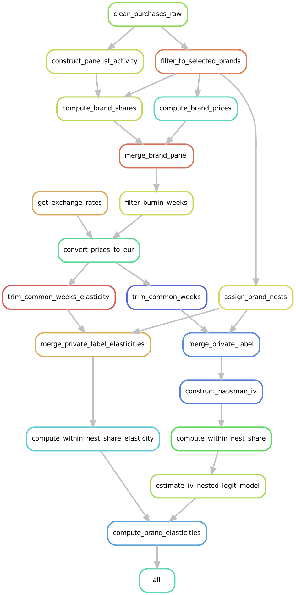

# 🛒 Demand Estimation Workflow: Meat Substitute Products

This repository contains a fully reproducible R-based data analysis pipeline for estimating consumer demand for meat substitute products. The project uses a Nested Logit specification and leverages Snakemake to orchestrate preprocessing, variable construction, and model estimation.

---

## 🧭 Project Overview

This project builds a demand estimation pipeline for scanner data on meat substitutes. It includes:

- Data cleaning and transformation
- Construction of IV instruments (Hausman-style)
- Computation of within-nest shares and other demand variables
- Estimation of a Nested Logit model
- Computation of brand-level elasticities

---

## 📁 Project Structure

```
├── Snakefile             # Main Snakemake workflow
├── paths.yaml            # Path config 
├── rules/                # Modular Snakemake rule files
│   ├── analysis.smk
│   ├── clean.smk
│   ├── data_mgt.smk
│   └── ...
├── src/                  # R scripts for analysis and preprocessing
│   ├── analysis/
│   │   ├── estimate_iv_nested_logit.R
│   │   └── compute_brand_elasticities.R
│   ├── data-management/
│   │   └── [scripts for all stages of data processing]
├── assets/               # DAG and graph visualizations
├── renv/, renv.lock      # R environment (via `renv`)
├── requirements.txt      # Python packages for Snakemake execution
├── dag.pdf               # Full DAG of workflow
├── rulegraph.pdf         # Rule dependency graph
├── filegraph.pdf         # File dependency graph
```

## ⚙️ Setup Instructions

1. **Unzip this repository, open your terminal and navigate to the root directory**

2. **Install Python Environment (for Snakemake)**

```bash
conda create -n demand-pipeline python=3.11
conda activate demand-pipeline
pip install -r requirements.txt
```

3. **Initialize R Environment**

We utilize many additional R packages inside the scripts that build our project.
To ensure that our project runs on every machine without issues relating to R packages not being installed we utilize `renv` to control the list of packages needed to run this example, and to monitor the version of the package we use.

Once you have completed the installation instructions above, we have provided a simple command to install renv.
Open a terminal and navigate to this directory.
Then in the terminal enter the following command to install renv:

``` bash
snakemake --cores 1 renv_install
```

Then you will need to provide consent for `renv` to be able to write files to your system:

``` bash
snakemake --cores 1 renv_consent
```

Once this is complete you can use renv to create a separate R environment that contains the packages we use in our example by entering the following command into the terminal:

``` bash
snakemake --cores 1 renv_init
```

The above command will initialize a separate R environment for this project.

Now we will install the necessary packages (and their precise versions) which are stored in the `renv.lock` file:

``` bash
snakemake --cores 1 renv_restore
```

This will install all the packages we need. It may take a while.


## 🚀 Running the Pipeline

Run the full workflow after changing to the project's root directory with:

```bash
snakemake --cores 4
```

To target a specific output (e.g., IV model estimation):

```bash
snakemake results/analysis/nested_logit_model.rds
```

You can visualize the DAG with:

```bash
snakemake --dag | dot -Tpdf > dag.pdf
```

---

## 📊 Key Outputs

- `results/analysis/nested_logit_model.rds`: Final IV Nested Logit model object
- `results/analysis/brand_elasticities.csv`: Computed own- and cross-price elasticities
- Visual DAGs: `dag.pdf`, `filegraph.pdf`, `rulegraph.pdf`

## Visualization of the Workflow

Snakemake workflows are a directed acyclic graph (DAG).
We can visualize the relationship between the rules (a simplified view of the DAG) in our workflow:



See `dag.pdf`, `filegraph.pdf`, `rulegraph.pdf` for alternative visualizations.
